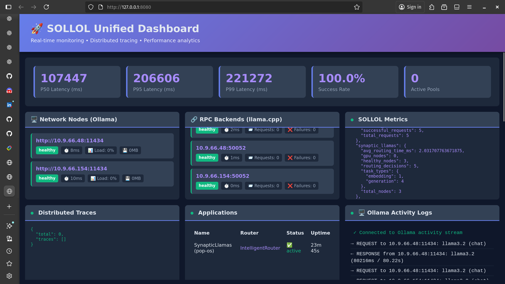
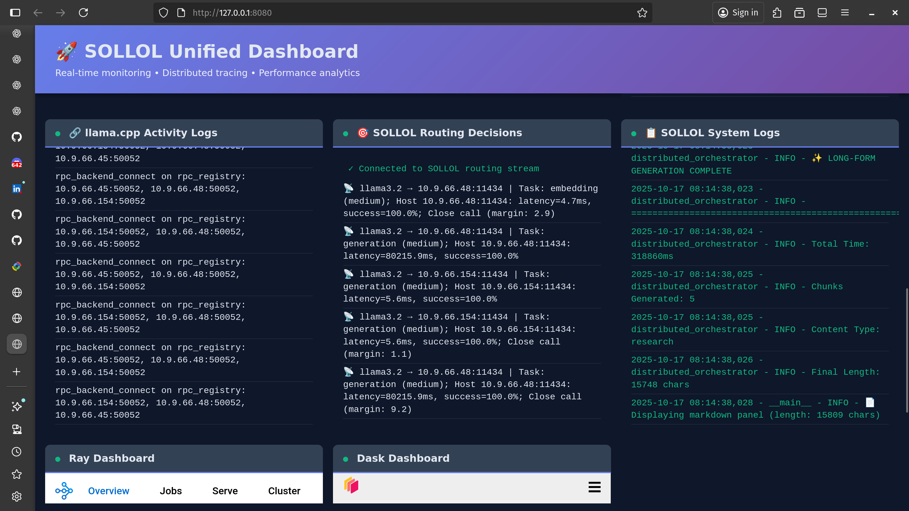
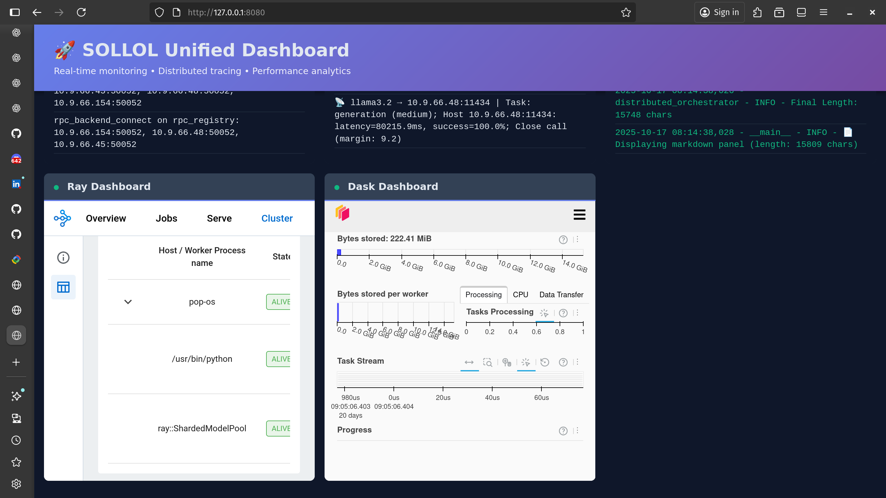

# SOLLOL: Intelligent Routing & Observability for Ollama Clusters

<div align="center">

<sup>Maintained by [B-A-M-N](https://github.com/B-A-M-N)</sup>

[](https://pypi.org/project/sollol/)
[](https://www.python.org/downloads/)
[](https://opensource.org/licenses/MIT)
[](https://github.com/B-A-M-N/SOLLOL/actions/workflows/tests.yml)
[](https://codecov.io/gh/B-A-M-N/SOLLOL)
[](https://ollama.ai/)

**Transform your Ollama nodes into a production AI cluster with adaptive routing that learns which nodes work best for each task, plus unified observability across all applications.**

✅ **Adaptive Routing**: GPU-aware, task-aware, learns from performance history
✅ **Production Observability**: Single dashboard for all applications and nodes
✅ **Zero-Config Discovery**: Auto-finds nodes, handles failover automatically
✅ **Proven Stable**: Powers FlockParser (5.5x speedup) and SynapticLlamas in production

[Quick Start](#-quickstart-3-commands) • [**📚 Distributed Guide**](docs/DISTRIBUTED_OLLAMA_GUIDE.md) • [Why SOLLOL](#-why-sollol) • [Architecture](#-architecture) • [Documentation](#-documentation)

</div>

---

## 🎯 What is SOLLOL?

SOLLOL (Super Ollama Load balancer & Orchestration Layer) is a **production-ready orchestration framework** that transforms your collection of Ollama nodes into an intelligent AI cluster with adaptive routing and unified observability—all running on your own hardware.

**The Problem You Have:**
- ❌ Manual node selection for each request
- ❌ Can't distribute multi-agent workloads efficiently
- ❌ No automatic failover or load balancing
- ❌ Zero visibility into cluster performance

**The SOLLOL Solution:**
- ✅ **Intelligent routing** that learns which nodes work best for each task
- ✅ **Parallel agent execution** for multi-agent frameworks
- ✅ **Auto-discovery** of Ollama nodes across your network
- ✅ **Built-in observability** with real-time metrics and dashboard
- ✅ **Automatic failover** and health monitoring

---

## ⚡ Quickstart (3 Commands)

```bash
# 1. Install SOLLOL
pip install sollol

# 2. Start the dashboard (optional but recommended)
python3 -m sollol.dashboard_service &

# 3. Run your first query
python3 -c "from sollol import OllamaPool; pool = OllamaPool.auto_configure(); print(pool.chat(model='llama3.2', messages=[{'role': 'user', 'content': 'Hello!'}])['message']['content'])"
```

**What just happened?**
- ✅ SOLLOL auto-discovered all Ollama nodes on your network
- ✅ Intelligently routed your request to the best available node
- ✅ Dashboard live at `http://localhost:8080` (shows routing decisions, metrics, logs)

**Expected output:**
```
Discovering Ollama nodes...
Found 3 nodes: 192.168.1.22:11434, 192.168.1.10:11434, localhost:11434
Selected node: 192.168.1.22:11434 (GPU, 12ms latency)
Hello! How can I help you today?
```

**Next steps:**
- Visit `http://localhost:8080` to see the dashboard
- **📚 [Read the Distributed Ollama Guide](docs/DISTRIBUTED_OLLAMA_GUIDE.md)** - Learn how to build distributed AI applications with proven patterns

---

## 🔥 Why SOLLOL?

### 1. **Intelligent, Not Just Balanced**

SOLLOL doesn't just distribute requests randomly—it **learns** and **optimizes**:

| Feature | Simple Load Balancer | SOLLOL |
|---------|---------------------|---------|
| **Routing** | Round-robin | Context-aware scoring |
| **Learning** | None | Adapts from performance history |
| **Resource Awareness** | None | GPU/CPU/memory-aware |
| **Task Optimization** | None | Routes by task type complexity |
| **Failover** | Manual | Automatic with health checks |
| **Priority** | FIFO | Priority queue with fairness |

**Example**: SOLLOL automatically routes:
- Heavy generation tasks → GPU nodes with 24GB VRAM
- Fast embeddings → CPU nodes or smaller GPUs
- Critical requests → Fastest, most reliable nodes
- Batch processing → Lower priority, distributed load

---

### 2. **Unified Observability for Your Entire AI Network**

SOLLOL provides a **single pane of glass** to monitor every application and every node in your distributed AI network.

- ✅ **Centralized Dashboard**: One web interface shows all applications, nodes, and performance metrics
- ✅ **Multi-App Tracking**: See which applications (e.g., SynapticLlamas, custom agents) are using the cluster in real-time
- ✅ **Network-Wide Visibility**: The dashboard runs as a persistent service, discovering and monitoring all components
- ✅ **Zero-Config**: Applications automatically appear in the dashboard with no extra code required

This moves beyond per-application monitoring to provide true, centralized observability for your entire infrastructure.

---

### 3. **Production-Ready from Day One**

```python
from sollol import OllamaPool

# Literally 3 lines to production
pool = OllamaPool.auto_configure()
response = pool.chat(model="llama3.2", messages=[...])
print(response['message']['content'])
```

**Out of the box**:
- Auto-discovery of Ollama nodes
- Health monitoring and failover
- Prometheus metrics
- Web dashboard with P50/P95/P99 latency tracking
- Connection pooling
- Request hedging
- Priority queuing

---

### 4. **Task Distribution at Scale**

Distribute **multiple requests** across your cluster in parallel:

```python
# Run 10 agents simultaneously across 5 nodes
pool = OllamaPool.auto_configure()
responses = await asyncio.gather(*[
    pool.chat(model="llama3.2", messages=[...])
    for _ in range(10)
])
# Parallel execution across available nodes
```

**Proven results:**
- ✅ **FlockParser**: 5.5x speedup on document processing
- ✅ **SynapticLlamas**: Parallel multi-agent execution across nodes
- ✅ **Production-tested**: Real-world applications running at scale

---

## 📸 Dashboard Screenshots

### Dashboard Overview

*Real-time monitoring with P50/P95/P99 latency metrics, network nodes, and active applications*

### Activity Monitoring

*Live request/response activity streams from Ollama nodes with performance tracking*

### Ray & Dask Integration

*Embedded Ray and Dask dashboards for distributed task monitoring*

---

## 🏗️ Production Applications

SOLLOL powers production-ready applications that leverage its intelligent routing and task distribution:

### [FlockParser](https://github.com/B-A-M-N/FlockParser)
**Distributed PDF Processing & RAG System**
- ✅ Production-stable document parsing and embedding
- ✅ Distributed vector search across Ollama cluster
- ✅ Automatic load balancing for embedding generation
- ✅ Real-time monitoring via SOLLOL dashboard
- **Use Case**: Enterprise document processing, RAG pipelines, knowledge base systems

### [SynapticLlamas](https://github.com/B-A-M-N/SynapticLlamas)
**Multi-Agent Collaboration Framework**
- ✅ Production-stable parallel agent execution
- ✅ Collaborative workflow orchestration (research → critique → synthesis)
- ✅ Quality control with automated validation
- ✅ Distributed across multiple Ollama nodes via SOLLOL
- **Use Case**: Complex reasoning tasks, research synthesis, multi-perspective analysis

---

## 🏗️ Architecture

### High-Level Overview

```
┌────────────────────────────────────────────────────────┐
│                  Your Application                       │
│         (SynapticLlamas, custom agents, etc.)          │
└──────────────────────┬─────────────────────────────────┘
                       │
                       ▼
┌────────────────────────────────────────────────────────┐
│                 SOLLOL Gateway (:8000)                  │
│  ┌──────────────────────────────────────────────────┐  │
│  │         Intelligent Routing Engine               │  │
│  │  • Analyzes: task type, complexity, resources    │  │
│  │  • Scores: all nodes based on context            │  │
│  │  • Learns: from performance history              │  │
│  │  • Routes: to optimal node                       │  │
│  └──────────────────────────────────────────────────┘  │
│  ┌──────────────────────────────────────────────────┐  │
│  │          Priority Queue + Failover               │  │
│  └──────────────────────────────────────────────────┘  │
└────────┬─────────────────────────────────────────────┘
         │
         ▼
┌────────────────────────────────────────────────────────┐
│              Your Heterogeneous Cluster                 │
│  GPU (24GB) │ GPU (16GB) │ CPU (64c) │ GPU (8GB) │...  │
└────────────────────────────────────────────────────────┘
```

### How Routing Works

```python
# 1. Request arrives
POST /api/chat {
  "model": "llama3.2",
  "messages": [{"role": "user", "content": "Complex analysis task..."}],
  "priority": 8
}

# 2. SOLLOL analyzes
task_type = "generation"       # Auto-detected
complexity = "high"             # Token count analysis
requires_gpu = True             # Based on task
estimated_duration = 3.2s       # From history

# 3. SOLLOL scores all nodes
Node A (GPU 24GB, load: 0.2, latency: 120ms) → Score: 185.3 ✓ WINNER
Node B (GPU 8GB,  load: 0.6, latency: 200ms) → Score: 92.1
Node C (CPU only, load: 0.1, latency: 80ms)  → Score: 41.2

# 4. Routes to Node A, monitors execution, learns for next time
```

**Scoring Algorithm**:
```
Score = 100.0 (baseline)
      × success_rate (0.0-1.0)
      ÷ (1 + latency_penalty)
      × gpu_bonus (1.5x if GPU available & needed)
      ÷ (1 + load_penalty)
      × priority_alignment
      × task_specialization
```

---

## 📦 Installation

### Quick Install (PyPI)
```bash
pip install sollol
```

### From Source
```bash
git clone https://github.com/B-A-M-N/SOLLOL.git
cd SOLLOL
pip install -e .
```

---

## ⚡ Quick Start

### 1. Synchronous API (No async/await needed!)

**New in v0.3.6:** SOLLOL provides a synchronous API for easier integration.

```python
from sollol.sync_wrapper import OllamaPool
from sollol.priority_helpers import Priority

# Auto-discover and connect to all Ollama nodes
pool = OllamaPool.auto_configure()

# Make requests - SOLLOL routes intelligently
# No async/await needed!
response = pool.chat(
    model="llama3.2",
    messages=[{"role": "user", "content": "Hello!"}],
    priority=Priority.HIGH,  # Semantic priority levels
    timeout=60  # Request timeout in seconds
)

print(response['message']['content'])
print(f"Routed to: {response.get('_sollol_routing', {}).get('host', 'unknown')}")
```

**Key features:**
- ✅ No async/await syntax required
- ✅ Works with synchronous agent frameworks
- ✅ Same intelligent routing and features
- ✅ Runs async code in background thread automatically

---

### 2. Priority-Based Multi-Agent Execution

```python
from sollol.sync_wrapper import OllamaPool
from sollol.priority_helpers import Priority, get_priority_for_role

pool = OllamaPool.auto_configure()

# Define agents with different priorities
agents = [
    {"name": "Researcher", "role": "researcher"},  # Priority 8
    {"name": "Editor", "role": "editor"},          # Priority 6
    {"name": "Summarizer", "role": "summarizer"},  # Priority 5
]

for agent in agents:
    priority = get_priority_for_role(agent["role"])

    response = pool.chat(
        model="llama3.2",
        messages=[{"role": "user", "content": f"Task for {agent['name']}"}],
        priority=priority
    )
    # User-facing agents get priority, background tasks wait
```

**Priority levels available:**
- `Priority.CRITICAL` (10) - Mission-critical
- `Priority.URGENT` (9) - Fast response needed
- `Priority.HIGH` (7) - Important tasks
- `Priority.NORMAL` (5) - Default
- `Priority.LOW` (3) - Background tasks
- `Priority.BATCH` (1) - Can wait

---

### 3. Enable Real-Time GPU Monitoring

For accurate VRAM-aware routing, install the GPU reporter on each node:

```bash
# On each Ollama node, run:
sollol install-gpu-reporter --redis-host <redis-server-ip>

# Example:
sollol install-gpu-reporter --redis-host 192.168.1.10
```

**What this does:**
- Installs vendor-agnostic GPU monitoring (NVIDIA/AMD/Intel via `gpustat`)
- Publishes real-time VRAM stats to Redis every 5 seconds
- SOLLOL uses this data for intelligent routing decisions
- See [GPU Monitoring Guide](GPU_MONITORING_GUIDE.md) for details

**Without GPU monitoring:** SOLLOL falls back to estimates which may be inaccurate.

---

## 📊 Performance & Benchmarks

### Production-Validated Performance

**FlockParser Document Processing:**
- ✅ **5.5x speedup** on large document batch processing
- ✅ Distributed embedding generation across nodes
- ✅ Production-tested with real-world workloads

**SynapticLlamas Multi-Agent:**
- ✅ **Parallel agent execution** across multiple nodes
- ✅ Automatic failover between agents
- ✅ Priority-based task scheduling

### Measured Baseline Performance

**Single Ollama Node** (llama3.2-3B, 50 requests, concurrency=5):
- ✅ **Success Rate:** 100%
- ⚡ **Throughput:** 0.51 req/s
- 📈 **Average Latency:** 5,659 ms
- 📈 **P95 Latency:** 11,299 ms
- 📈 **P99 Latency:** 12,259 ms

**Hardware:** Single Ollama instance with 75+ models loaded
**Data:** See [`benchmarks/results/`](benchmarks/results/) for raw JSON

**Run Your Own:**
```bash
# Baseline test (no cluster needed)
python benchmarks/simple_ollama_benchmark.py llama3.2 50

# Comparative test (requires docker-compose)
docker-compose up -d
python benchmarks/run_benchmarks.py --sollol-url http://localhost:8000 --duration 60
```

### Overhead

- **Routing decision**: ~5-10ms (tested with 5-10 nodes)
- **Network overhead**: Varies by network (typically 5-20ms)
- **Total added latency**: ~20-50ms
- **Benefit**: Better resource utilization + automatic failover

---

## 📚 Building Distributed Applications

**New to distributed Ollama?** Read our comprehensive guide:

### **[Distributed Ollama Guide](docs/DISTRIBUTED_OLLAMA_GUIDE.md)**

Learn to build production-grade distributed AI applications with:
- **4 proven architecture patterns** (batch processing, multi-agent, code synthesis)
- **Real performance data** from production applications
- **Complete code examples** from real projects
- **Performance tuning guide** for your workload
- **Production best practices** and troubleshooting

**Quick preview:**
```python
from sollol import OllamaPool

# Auto-discover and distribute work across cluster
pool = OllamaPool.auto_configure()

# Batch process 10,000 embeddings with adaptive parallelism
embeddings = pool.embed_batch(
    model="mxbai-embed-large",
    inputs=texts,
    use_adaptive=True  # SOLLOL optimizes based on node speeds
)
# Automatic work stealing, retry logic, and real-time dashboard
```

---

## ⚙️ Advanced Configuration

### Custom Routing Strategy

```python
from sollol import OllamaPool

pool = OllamaPool(
    nodes=[
        {"host": "gpu-1.local", "port": 11434, "priority": 10},  # Prefer this
        {"host": "gpu-2.local", "port": 11434, "priority": 5},
        {"host": "cpu-1.local", "port": 11434, "priority": 1},   # Last resort
    ],
    enable_intelligent_routing=True,
    enable_hedging=True,  # Duplicate critical requests
    max_queue_size=100
)
```

### Observability & Monitoring

#### **Zero-Config Auto-Registration** 🎯

SOLLOL provides **automatic observability** with zero configuration required:

```python
from sollol import OllamaPool

# Creates pool AND auto-registers with dashboard (if running)
pool = OllamaPool.auto_configure()
# ✅ Application automatically appears in dashboard at http://localhost:8080
```

#### **Persistent Dashboard Service**

Start the persistent dashboard once (survives application exits):

```bash
# Start dashboard service (runs until stopped)
python3 -m sollol.dashboard_service --port 8080 --redis-url redis://localhost:6379

# Or run in background
nohup python3 -m sollol.dashboard_service --port 8080 --redis-url redis://localhost:6379 > /tmp/dashboard_service.log 2>&1 &
```

**Features:**
- 📊 **Real-time metrics**: System status, latency, success rate, GPU memory
- 📜 **Live log streaming**: WebSocket-based log tailing (via Redis pub/sub)
- 🌐 **Activity monitoring**: Ollama server activity tracking
- 🔍 **Auto-discovery**: Automatically discovers Ollama nodes

#### **Programmatic Stats Access**

```python
# Get detailed stats
stats = pool.get_stats()
print(f"Total requests: {stats['total_requests']}")
print(f"Average latency: {stats['avg_latency_ms']}ms")
print(f"Success rate: {stats['success_rate']:.2%}")

# Per-node breakdown
for host, metrics in stats['hosts'].items():
    print(f"{host}: {metrics['latency_ms']}ms, {metrics['success_rate']:.2%}")
```

---

## 🏭 Production Deployment

### **Multi-Node Bare Metal Setup**

For teams preferring bare metal infrastructure, SOLLOL provides systemd-based deployment:

#### **Architecture:**
```
┌─────────────────────────────────────────┐
│   Central Router Machine                │
│   - SOLLOL Dashboard (port 8080)        │
│   - Redis (port 6379)                   │
└────────────┬────────────────────────────┘
             │ Auto-discovery
     ┌───────┼──────────┬─────────────┐
     ▼       ▼          ▼             ▼
┌─────────┐ ┌─────────┐ ┌─────────┐ ┌─────────┐
│ Node 1  │ │ Node 2  │ │ Node 3  │ │ Node N  │
│ Ollama  │ │ Ollama  │ │ Ollama  │ │ Ollama  │
│ :11434  │ │ :11434  │ │ :11434  │ │ :11434  │
│ GPU 24GB│ │ GPU 16GB│ │ CPU 64c │ │ ...     │
└─────────┘ └─────────┘ └─────────┘ └─────────┘
```

**Quick Setup:**

```bash
# 1. Install Ollama on each node
curl -fsSL https://ollama.ai/install.sh | sh

# 2. Install SOLLOL on control plane
pip install sollol redis

# 3. Start dashboard
python3 -m sollol.dashboard_service --port 8080 --redis-url redis://localhost:6379

# 4. Test discovery
python3 -c "from sollol import OllamaPool; pool = OllamaPool.auto_configure(); print(pool.get_stats())"
```

See [INSTALLATION.md](INSTALLATION.md) for complete deployment guide including systemd services and production hardening.

---

## 🎓 Use Cases

### 1. Multi-Agent AI Systems (SynapticLlamas, CrewAI, AutoGPT)

**Problem**: Running 10 agents sequentially takes 10x longer than necessary.

**Solution**: SOLLOL distributes agents across nodes in parallel.

```python
pool = OllamaPool.auto_configure()
agents = await asyncio.gather(*[
    pool.chat(model="llama3.2", messages=agent_prompts[i])
    for i in range(10)
])
# Speedup depends on number of available nodes and their capacity
```

### 2. Mixed Workloads

**Problem**: Different tasks need different resources.

**Solution**: SOLLOL routes each task to the optimal node.

```python
pool = OllamaPool.auto_configure()

# Heavy generation → GPU node
chat = pool.chat(model="llama3.2:70b", messages=[...])

# Fast embeddings → CPU node
embeddings = pool.embed(model="nomic-embed-text", input=[...])

# SOLLOL automatically routes each to the best available node
```

### 3. High Availability Production

**Problem**: Node failures break your service.

**Solution**: SOLLOL auto-fails over and recovers.

```python
# Node A fails mid-request
# ✅ SOLLOL automatically:
# 1. Detects failure
# 2. Retries on Node B
# 3. Marks Node A as degraded
# 4. Periodically re-checks Node A
# 5. Restores Node A when healthy
```

---

## 🔌 Integration Examples

### SynapticLlamas Integration

```python
from sollol import OllamaPool

# SynapticLlamas uses SOLLOL for intelligent routing
pool = OllamaPool(
    nodes=None,  # Auto-discover all Ollama nodes
    enable_intelligent_routing=True,
    app_name="SynapticLlamas",
    enable_ray=True
)

# All agent execution routes through SOLLOL
response = pool.chat(model="llama3.2", messages=[{"role": "user", "content": "query"}])
```

### FlockParser Integration

```python
from sollol import OllamaPool

# FlockParser uses SOLLOL's OllamaPool directly
pool = OllamaPool(
    nodes=None,  # Auto-discover all Ollama nodes
    enable_intelligent_routing=True,
    exclude_localhost=True,
    discover_all_nodes=True,
    app_name="FlockParser",
    enable_ray=True
)

# All document embeddings and queries route through SOLLOL
embeddings = pool.embed(model="mxbai-embed-large", input="document text")
```

### LangChain Integration

```python
from langchain.llms import Ollama
from sollol import OllamaPool

# Use SOLLOL as LangChain backend
pool = OllamaPool.auto_configure()

llm = Ollama(
    base_url="http://localhost:8000",
    model="llama3.2"
)

# LangChain requests now go through SOLLOL
response = llm("What is quantum computing?")
```

---

## ⚡ Performance Optimizations

SOLLOL includes production-grade performance optimizations:

### 🚀 Response Caching Layer

Intelligent LRU cache with TTL expiration:
```python
from sollol import OllamaPool

# Enable response caching (enabled by default)
pool = OllamaPool.auto_configure(
    enable_cache=True,
    cache_max_size=1000,  # Cache up to 1000 responses
    cache_ttl=3600        # 1 hour TTL
)

# Get cache stats
stats = pool.get_cache_stats()
print(f"Hit rate: {stats['hit_rate']:.1%}")
```

### 🌊 Streaming Support

Token-by-token streaming for better UX:
```python
# Stream chat responses
for chunk in pool.chat(
    model="llama3.2",
    messages=[{"role": "user", "content": "Tell me a story"}],
    stream=True
):
    content = chunk.get("message", {}).get("content", "")
    print(content, end="", flush=True)
```

### 🔥 Smart Model Prefetching

Pre-load models into VRAM before first use:
```python
# Warm a single model
pool.warm_model("llama3.2")

# Warm multiple models in parallel
results = pool.warm_models(
    models=["llama3.2", "codellama", "mistral"],
    parallel=True
)
```

### Additional Optimizations

- **Connection Pool Tuning**: Optimized pool sizes for better concurrency
- **Adaptive Health Checks**: Dynamic intervals based on node stability
- **Telemetry Sampling**: Configurable sampling reduces overhead by ~90%
- **HTTP/2 Multiplexing**: 30-50% latency reduction for concurrent requests

---

## 📚 Documentation

### Getting Started

- **[Installation Guide](INSTALLATION.md)** - Complete setup for bare-metal deployment
- **[Quick Start](QUICK_START.md)** - Get up and running in 3 commands
- **[Configuration](CONFIGURATION.md)** - All configuration options
- **[Architecture](ARCHITECTURE.md)** - System architecture overview

### Complete Documentation

See **[docs/](docs/)** for detailed documentation organized by category:

- **[Setup Guides](docs/setup/)** - Ray, Redis, GPU monitoring, Grafana
- **[Features](docs/features/)** - Routing, dashboard, batch processing
- **[Architecture](docs/architecture/)** - System design and patterns
- **[Integration](docs/integration/)** - Code examples and walkthroughs
- **[Benchmarks](docs/benchmarks/)** - Performance testing and results
- **[Troubleshooting](docs/troubleshooting/)** - Known issues and fixes

---

## 🤝 Contributing

We welcome contributions! Areas we'd love help with:

- ML-based routing predictions
- Additional monitoring integrations
- Cloud provider integrations
- Performance optimizations
- Documentation improvements

See [CONTRIBUTING.md](CONTRIBUTING.md) for guidelines.

---

## 🔬 Experimental: Distributed Inference Research

**⚠️ Research Feature - Not Production Ready**

SOLLOL includes experimental distributed inference capabilities via llama.cpp RPC integration. This feature distributes model layer computation across multiple nodes.

**Current Status:**
- ✅ Basic functionality validated (13B models, 2-3 nodes)
- ⚠️ **Performance**: 5x slower than local inference
- ⚠️ **Complexity**: Requires manual setup, exact version matching
- ⚠️ **Limitation**: Coordinator still requires full model in RAM

**When to use this:**
- Research and experimentation only
- When you absolutely need to run a model that won't fit on any single node
- When you're willing to accept significant performance tradeoffs

**For production workloads:** Use SOLLOL's proven task distribution features instead.

**Learn more:**
- 📖 [EXPERIMENTAL_FEATURES.md](EXPERIMENTAL_FEATURES.md) - Honest assessment, realistic expectations, known issues
- 💻 [Complete llama.cpp Guide](docs/llama_cpp_guide.md) - Setup, optimization, troubleshooting
- 📚 [Distributed Ollama Guide](docs/DISTRIBUTED_OLLAMA_GUIDE.md) - Production-ready patterns

**Future Work:**

Further optimization of distributed inference requires:
- Multi-node cluster infrastructure for comprehensive testing
- Performance tuning to reduce startup time and inference overhead
- Automated version management and deployment

**Status:** Research track with working foundation. See `src/sollol/distributed_pipeline.py` for technical details.

---

## 📜 License

MIT License - see [LICENSE](LICENSE) file for details.

---

## 🙏 Credits

Created by [B-A-M-N](https://github.com/B-A-M-N)

**Part of the Complete AI Ecosystem:**
- **[SynapticLlamas](https://github.com/B-A-M-N/SynapticLlamas)** - Multi-Agent Orchestration
- **[FlockParser](https://github.com/B-A-M-N/FlockParser)** - Document RAG Intelligence
- **[SOLLOL](https://github.com/B-A-M-N/SOLLOL)** - Distributed Inference Platform (this project)

**Special Thanks:**
- **[Dallan Loomis](https://github.com/DallanL)** - For always providing invaluable support, feedback, and guidance throughout development

Built with: Ray, Dask, FastAPI, llama.cpp, Ollama

---

## 🎯 What Makes SOLLOL Different?

1. **Adaptive routing** that learns from performance history
2. **Context-aware scoring** based on task type, complexity, and resources
3. **Auto-discovery** of nodes with minimal configuration
4. **Built-in failover** and priority queuing
5. **Production-ready**: Powers FlockParser and SynapticLlamas at scale
6. **Unified observability**: Single dashboard for entire AI network

---

<div align="center">

**Stop manually managing your LLM cluster. Let SOLLOL optimize it for you.**

[Get Started](#-quickstart-3-commands) • [View on GitHub](https://github.com/B-A-M-N/SOLLOL) • [Report Issue](https://github.com/B-A-M-N/SOLLOL/issues)

</div>
